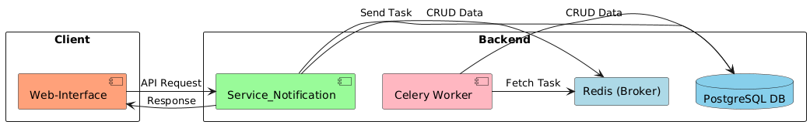
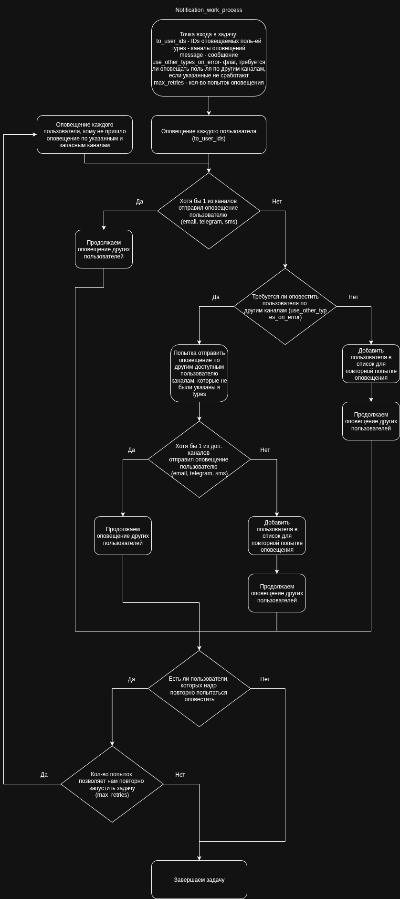

# Notification Project

* * *

**Задача (Бизнес Задача):**
1. Создать сервис для отправки уведомлений пользователям;

* * *


## Оглавление:
- [Требования](#требования)
- [Архитектура сервиса](#архитектура-сервиса)
- [Используемые решения в проекте](#используемые-решения-в-проекте)
- [Описание работы отправки оповещения](#описание-работы-отправки-оповещения)
- [Запуск проекта (локально)](#запуск-проекта-локально)
- [Запуск проекта (docker-compose)](#запуск-проекта-docker-compose)
- [Документация проекта](#документация-проекта)
- [Дальнейшие доработки](#дальнейшие-доработки-проекта)
- [Соглашения разработки](#соглашения-разработки)
- [Code Style](#code-style)


## Требования:
### Функциональные:
1. Отправка сообщения указанным пользователям через: email, sms, telegram.
2. Предоставить возможность отправки сообщения через альтернативные каналы, если указанные каналы пользователем не 
отправили сообщение.

### Нефункциональные:
- **Availability**(доступность системы):
- - SLA(Service Level Agreement): 99%;
- - Время обработки запроса: ~200-300мс.;
- **Reliability**(надежность системы): >= 85%;
- **Fault Tolerance**(отказоустойчивость системы):


## Архитектура сервиса:



## Используемые решения в проекте:
- Django Rest-Framework(v.3.16.1): https://www.django-rest-framework.org/;
- Django(v.5.2.6): https://docs.djangoproject.com/en/5.2/;
- Redis(v.7.2-bookworm) - redis v.6.2.0: https://redis.io/;
- Postgres(v.17.5) - psycopg2-binary v.2.9.10: https://www.postgresql.org/;
- Uvicorn(v. 0.35.0): https://www.uvicorn.org/;
- Celery(v. 5.5.3): https://docs.celeryq.dev/en/stable/
- PythonTelegramBot(v. 22.4): https://python-telegram-bot.org/;
- Twilio(v. 9.8.1): https://www.twilio.com/docs/libraries/reference/twilio-python/index.html;

## Описание работы отправки оповещения:



## Запуск проекта (локально):
1. Создайте файл **.env** и скопируйте в него конфигурации из файла **.env_example**. Добавьте те конфигурации, 
которые имеют **[Local]** (это необходимый минимум, остальные по необходимости). Обратите внимание на конфигурации при 
поднятии доп. сервисов и запуске проекта (например, **POSTGRES_HOST** и **REDIS_HOST**). 

2. При необходимости, поднимите связанные сервисы в **docker-compose-local.yaml** (PostgreSQL, Redis):
```sh
docker compose -f ./docker-compose-local.yaml up -d
```

3. Установите зависимости:
```sh
pip install -r requirements.txt
```

4. Запустите проект (требуется указать директорию **service_notification** как root):
```sh
cd ./service_notification
uvicorn service_notification.asgi:application --host 127.0.0.1 --port 8000 --reload
```


## Запуск проекта (docker-compose):
1. Создайте файл **.env** и скопируйте в него конфигурации из файла **.env_example**. Добавьте те конфигурации, 
которые имеют **[Docker_Compose]** (это необходимый минимум, остальные по необходимости).

2. Поднимите сервисы:
```sh
docker compose -f ./docker-compose.yaml up -d
```

3. Или, если требуется поднять сервисы с открытыми портами сервисов (**PostgreSQL, Redis**):
```sh
docker compose -f ./docker-compose.yaml -f docker-compose.override.yaml up -d
```


## Документация проекта:
- Swagger (после запуска проекта): **http://127.0.0.1:8000/api/swagger/**


## Дальнейшие доработки проекта:
- Добавление Web-Service (Nginx);
- Добавление логики с шаблонами оповещений: позволить пользователям не только отправлять оповещения в виде текста, но 
и выбрать шаблон оповещения (с предзаполнением информации, согласно шаблону);
- Вынести Celery в качестве отдельного сервиса;
- Добавить оповещение пользователя по WebSocket об успешном или не успешном отправке сообщения.
- Добавить сервис-агрегатор, который будет на основе шаблона агрегировать данные из внутренних сервисов и оповещать 
пользователя.


## Соглашения разработки:
### GitFlow:
#### Ветки (branches):
- **main**: основная(работоспособная) ветка кода, содержащая код для отправки на ревью;
- **develop**: рабочая ветка, содержащая актуальную кодовую базу для разработки;

#### Работа с ветками:
- Разработка нового функционала: branch: develop -> feature/....;
- Исправление ошибки в новом функционале: branch: develop(main) -> fix/...;

### RESTful URI:
#### Версионирование:
- Поддержка **Stripe**-подхода (https://docs.stripe.com/api/versioning);

#### Шаблоны построения URI-методов:
- Ссылка на источник: https://www.vinaysahni.com/best-practices-for-a-pragmatic-restful-api#restful


## Code Style:
## TODO:
- **PEP8**(https://peps.python.org/pep-0008/);
- Docstring-формат - **reStructuredText (reST)**;
